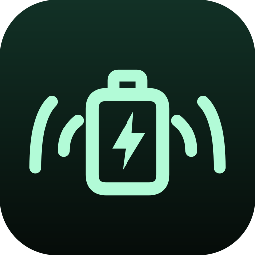

<div align="center">



# Battery Alarm

**Avisa cuando tu celular termina de cargar.**

`Gratis · Open Source · Sin publicidad · Sin Internet · Sin cuentas`

[](LICENSE)
[](https://developer.android.com/studio)
[](https://github.com/Norvyz/Battery-Alarm/releases)

</div>

---

## Qué hace

Algunos cargadores y celulares no avisan cuando la batería está llena. Esta app lo hace por ti: abres la app, pulsas **Iniciar monitoreo**, conectas el cargador y te olvidas. Cuando la batería llega al 100 %, espera el tiempo que tú elijas y suena una alarma para que desconectes el cargador.

```
Iniciar monitoreo → conectar el cargador → detectar 100% → esperar el tiempo configurado → alarma
```

## Cómo funciona

1. Abres la app y pulsas **Iniciar monitoreo**.
2. Conectas el cargador (opcionalmente puedes activar **Iniciar al conectar el cargador** para que ese paso se haga solo).
3. Aparece una notificación permanente con el nivel de batería y un botón **Detener**.
4. Al llegar al **100 %**, la app espera el tiempo configurado. Por defecto son **2 minutos**, y puedes elegir 1, 5, 10, 15 o un valor personalizado (1 a 120 minutos).
5. Suena la alarma con el sonido que elegiste: alarma del sistema, notificación del sistema o un archivo de audio propio. Si activas el **boost**, puedes elegir cuánto subir el volumen mientras suena.
6. El monitoreo termina solo: al detenerlo desde la notificación o al desconectar el cargador antes del 100 %.

La app no monitorea la batería de forma permanente: el servicio solo se mantiene mientras tú decides vigilar una carga.

## Qué hace con tus datos

Nada. No pide cuentas, no usa Internet y no envía ningún dato a ningún servidor. Toda la configuración queda en tu teléfono.

## Cómo verificar lo que hace

Este proyecto es **código abierto**: no tienes que confiar en esta descripción. Puedes revisar el código en este repositorio y, si no sabes leer código, puedes descargar el contenido, pedirle a una IA que analice qué hace la app y compararlo con lo que ves en pantalla. Todo lo que hace está en este repositorio.

## Capturas

<div align="center">

| Preview | Notificación |
| --- | --- |
|  |  |

</div>

<br/>

## Instalar

Descarga la última APK desde la pestaña [Releases](https://github.com/Norvyz/Battery-Alarm/releases).

## Desarrollar

```bash
./gradlew assembleDebug    # APK de depuración
./gradlew assembleRelease  # APK release
```

La APK release queda en `app/build/outputs/apk/release/app-release.apk`.

## Diseño e identidad

Toda la iconografía es **SVG** hecha a medida para el proyecto, sin depender de emojis del sistema.

**El logo** es una **batería con su rayo de carga y ondas de sonido a los dos lados**, todo en un solo color menta: la batería que se carga al máximo, el rayo que la carga y la alarma que avisa cuando termina.

| Archivo | Descripción |
| --- | --- |
| `brand/logo.svg` | Logo principal (fondo + símbolo), para README y web |
| `brand/icon-foreground.svg` | Símbolo con fondo transparente (foreground del icono adaptativo) |
| `brand/IconRenderer.java` | Genera los mipmaps PNG heredados a partir de la misma geometría |
| `brand/AssetsGen.java` | Genera los iconos del repositorio |
| `assets/` | Iconos y banner del repositorio (`icon-512.png`, `icon-192.png`, `social-preview.png`) |
| `res/drawable/ic_launcher_foreground.xml` | Icono adaptativo (Android 8+) |
| `res/drawable/logo.xml` | Emblema usado dentro de la app |

## Agradecimientos

Hecho con <3 para **Norvyz**.

## Licencia

[MIT](LICENSE) © Battery Alarm contributors

<div align="center">

<sub>
Hecho con 💚 por
<a href="https://github.com/Norvyz">Norvyz</a>
</sub>

</div>
